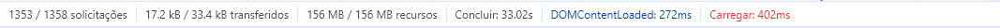

#Poke Api

Tabela de conteúdos
=================
   * [Sobre](#sobre)
   * [Tecnologias](#tecnologias)
   * [Desafios](#desafios)
   * [Screenshot](#Utilização-do-Projeto)
   * [Paginação](#paginação)

## Sobre

Uma API de Pokédex, que através da Fetch API no JavaScript, cria requisições de informações para a <strong>pokeapi(https://pokeapi.co/)</strong>.    Essas informações são exibidas em uma estilização desenvolvida apartir do <strong>React Styled Components</strong>.

## Tecnologias

    
    
    
  

## Desafios

Meu primeiro desafio foi desenvolver uma busca nos EndPoints da Api para saber qual caminho tomar.Eu utilizei Axios para fazer as requisições e Varios Consoles.log KKKK.
Outros desafios que tive ao decorrer do projeto foram:
- Como utilizar o React Router Dom para fazer as SPA funcionais e que quando eu atualizasse a página em certa rota essa mesma não desse erros.
- Outro desafio foi fazer um sessionStorage para guardar algumas informações importantes.
- Um dos ultimos desafios foi a refatoração do código e deixar ele mais flúido.
## Utilização do Projeto

>

## Paginação

> `Paginação é um conceito ou melhor, uma técnica para dividir o conjunto de resultados em pequenos pedaços para o usuário navegar através dele com facilidade.`   
> Como um dos desafios criei um botão que quando o usuário clique carregue mais 10 pokemons, isso evita eu ter que carregar mais de 1000 pokemons de uma só vez, o que causaria uma lentidão no carregamento da pagina. Como exemplos vou colocar uma screenshot do meu projeto na sua versão anterior e uma quando finalizado para comparar a quantidade de recursos utilizados em cada uma.
Versão antiga:

Versão nova:

Fazendo isso consegui uma redução de 156MB para 3.9MB.

